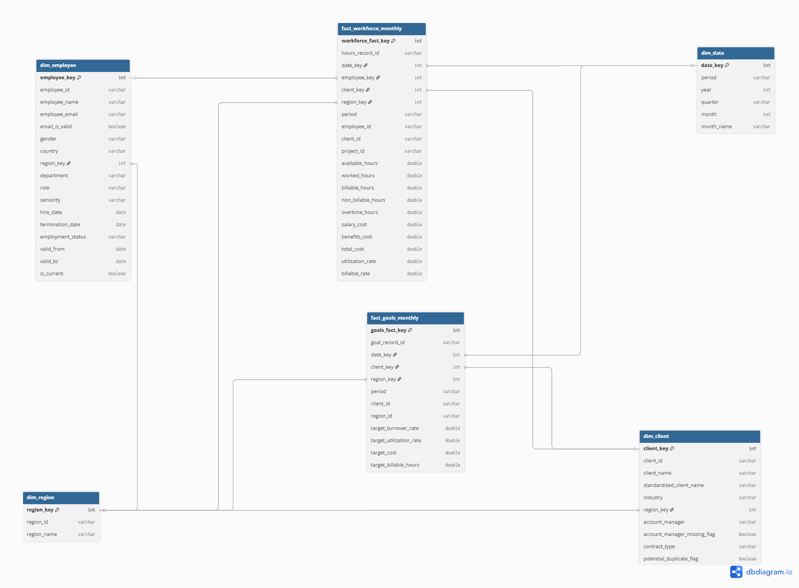

# Data Model — WorkBridge Workforce Analytics

This document describes the implemented Gold analytical data model for the WorkBridge Workforce Analytics project.

The model is designed to support executive workforce reporting in Power BI using a dimensional structure built from the validated Silver layer.

## Modeling Approach

The Gold layer uses a dimensional analytical model with:

- Dimension tables for descriptive business entities.
- Fact tables for measurable business events and targets.
- Model-owned numeric surrogate keys.
- Source identifiers preserved for traceability.

The model follows a reporting-oriented structure where Power BI consumes Gold tables, not raw Bronze or normalized Silver tables.

The implemented model follows a **fact constellation schema**, also known as a **galaxy schema**, because it contains more than one fact table sharing common dimensions.

---

## Gold Model Schema

The following diagram represents the implemented Gold analytical model.



### Schema Type

The Gold model is best described as:

```text
Fact constellation schema with controlled snowflake-style normalization
```

This is because:

- The model contains two fact tables:
  - `fact_workforce_monthly`
  - `fact_goals_monthly`
- The fact tables share dimensions:
  - `dim_date`
  - `dim_client`
  - `dim_region`
- `dim_region` is also linked to `dim_employee` and `dim_client`, adding a small normalized structure for consistent regional analysis.

### Power BI Relationship Note

The diagram represents the logical Gold model.

In Power BI, relationships involving `dim_region` may need to be configured carefully to avoid ambiguous filter paths, because region can relate to workforce facts directly and also through employee or client dimensions.

---

## Gold Tables

The implemented Gold model contains four dimensions and two fact tables.

### Dimensions

- `dim_date`
- `dim_region`
- `dim_employee`
- `dim_client`

### Fact Tables

- `fact_workforce_monthly`
- `fact_goals_monthly`

---

## Key Design

The Gold layer generates numeric surrogate keys for analytical modeling.

| Gold Key | Table | Description |
|---|---|---|
| `date_key` | `dim_date` | Monthly date key in `YYYYMM` format |
| `region_key` | `dim_region` | Numeric surrogate key for standardized regions |
| `employee_key` | `dim_employee` | Numeric surrogate key for employees |
| `client_key` | `dim_client` | Numeric surrogate key for clients |
| `workforce_fact_key` | `fact_workforce_monthly` | Numeric surrogate key for workforce fact records |
| `goals_fact_key` | `fact_goals_monthly` | Numeric surrogate key for goals fact records |

Source identifiers such as `employee_id`, `client_id`, `region_id`, `period`, `hours_record_id` and `goal_record_id` are preserved for traceability.

---

# Dimensions

## `dim_date`

Contains monthly calendar information used for reporting and time-based analysis.

### Primary Key

- `date_key`

### Columns

| Column | Description |
|---|---|
| `date_key` | Numeric date key in `YYYYMM` format |
| `period` | Monthly reporting period in `YYYY-MM` format |
| `year` | Reporting year |
| `quarter` | Calendar quarter |
| `month` | Month number |
| `month_name` | Month name |

### Grain

One row per monthly period.

### Main Usage

- Analyze workforce KPIs by month.
- Aggregate metrics by quarter or year.
- Connect monthly facts to a consistent calendar dimension.

---

## `dim_region`

Contains standardized region information used across the Gold model.

### Primary Key

- `region_key`

### Columns

| Column | Description |
|---|---|
| `region_key` | Numeric surrogate key for the region |
| `region_id` | Normalized region code from Silver, such as `LATAM`, `NA`, `EMEA` or `APAC` |
| `region_name` | Descriptive region name |

### Grain

One row per standardized region.

### Main Usage

- Analyze costs, hours, utilization and goals by region.
- Provide a single consistent region reference for dimensions and fact tables.
- Avoid repeated region text values across the model.

---

## `dim_employee`

Contains employee descriptive information.

### Primary Key

- `employee_key`

### Source Identifier

- `employee_id`

### Foreign Key

| Column | References |
|---|---|
| `region_key` | `dim_region.region_key` |

### Columns

| Column | Description |
|---|---|
| `employee_key` | Numeric surrogate key generated in Gold |
| `employee_id` | Source employee identifier preserved from Silver |
| `employee_name` | Employee full name |
| `employee_email` | Employee email address |
| `email_is_valid` | Flag indicating whether the employee email format is valid |
| `gender` | Normalized gender value |
| `country` | Employee country |
| `region_key` | Foreign key to `dim_region` |
| `department` | Employee department or business area |
| `role` | Employee job role |
| `seniority` | Employee seniority level |
| `hire_date` | Employee hire date |
| `termination_date` | Employee termination date, if applicable |
| `employment_status` | Normalized employment status |
| `valid_from` | Start date of the current dimension version |
| `valid_to` | End date of the dimension version |
| `is_current` | Indicates whether the row is the current version |

### Grain

One row per employee in the current initial-load dimension.

### SCD Type 2 Readiness

`dim_employee` includes SCD Type 2 columns:

- `valid_from`
- `valid_to`
- `is_current`

Since the current dataset contains a single cleaned employee snapshot, all employee records are loaded as current records.

In a future incremental load, SCD Type 2 logic could compare incoming employee records against existing current records and create a new version when tracked attributes such as department, role, seniority, region or employment status change.

### Main Usage

- Analyze workforce distribution by department, role, seniority or region.
- Filter workforce KPIs by employee attributes.
- Support future historical tracking of employee changes.

---

## `dim_client`

Contains client descriptive information.

### Primary Key

- `client_key`

### Source Identifier

- `client_id`

### Foreign Key

| Column | References |
|---|---|
| `region_key` | `dim_region.region_key` |

### Columns

| Column | Description |
|---|---|
| `client_key` | Numeric surrogate key generated in Gold |
| `client_id` | Source client identifier preserved from Silver |
| `client_name` | Client company name |
| `standardized_client_name` | Standardized client name used for duplicate detection |
| `industry` | Client industry |
| `region_key` | Foreign key to `dim_region` |
| `account_manager` | Account manager responsible for the client |
| `account_manager_missing_flag` | Flag indicating missing account manager information |
| `contract_type` | Normalized contract type |
| `potential_duplicate_flag` | Flag indicating potential duplicate client names |

### Grain

One row per valid client.

### Main Usage

- Analyze workforce KPIs by client.
- Filter dashboards by industry, contract type and region.
- Support executive reporting by client.

---

# Fact Tables

## `fact_workforce_monthly`

Main workforce fact table for monthly executive reporting.

### Primary Key

- `workforce_fact_key`

### Foreign Keys

| Column | References |
|---|---|
| `date_key` | `dim_date.date_key` |
| `employee_key` | `dim_employee.employee_key` |
| `client_key` | `dim_client.client_key` |
| `region_key` | `dim_region.region_key` |

### Source Identifiers Preserved

| Column | Description |
|---|---|
| `hours_record_id` | Logical hour record identifier from Silver |
| `period` | Monthly reporting period from Silver |
| `employee_id` | Source employee identifier |
| `client_id` | Source client identifier |
| `project_id` | Source project identifier |

### Grain

One row per:

- monthly period
- employee
- client
- project

This means each row represents the monthly workforce activity of one employee for one client and one project.

### Metrics

| Column | Description |
|---|---|
| `available_hours` | Total hours the employee was available to work during the period |
| `worked_hours` | Total hours actually worked by the employee during the period |
| `billable_hours` | Hours that can be billed to the client |
| `non_billable_hours` | Worked hours that cannot be billed to the client |
| `overtime_hours` | Hours worked beyond expected available hours |
| `salary_cost` | Salary cost associated with the employee for the period |
| `benefits_cost` | Additional employment-related cost for the period |
| `total_cost` | Total employee cost for the period |
| `utilization_rate` | Percentage of available hours that were worked |
| `billable_rate` | Percentage of worked hours that were billable |

### KPI Formulas

```text
utilization_rate = worked_hours / available_hours
billable_rate = billable_hours / worked_hours
```

`utilization_rate` may be greater than 1 when worked hours exceed available hours due to overtime.

### Cost Join Note

`silver_costs` is stored at employee-month grain, while `silver_hours` is stored at period + employee + client + project grain.

For this version, employee monthly costs are joined into `fact_workforce_monthly` using:

```text
period + employee_id
```

This enables combined workforce and cost reporting, but monthly employee costs may repeat across multiple client/project records if an employee worked for more than one client or project in the same month.

A future improvement could allocate employee monthly costs proportionally based on worked hours.

### Main Usage

- Analyze worked, billable and overtime hours.
- Analyze workforce costs by month, employee, client or region.
- Calculate utilization and billable rates.
- Support executive operational reporting.

---

## `fact_goals_monthly`

Monthly goals fact table used to compare workforce performance against business targets.

### Primary Key

- `goals_fact_key`

### Foreign Keys

| Column | References |
|---|---|
| `date_key` | `dim_date.date_key` |
| `client_key` | `dim_client.client_key` |
| `region_key` | `dim_region.region_key` |

### Source Identifiers Preserved

| Column | Description |
|---|---|
| `goal_record_id` | Logical goal record identifier from Silver |
| `period` | Monthly reporting period from Silver |
| `client_id` | Source client identifier |
| `region_id` | Normalized region code from Silver |

### Grain

One row per:

- monthly period
- client
- region

This means each row represents the monthly target values defined for one client in one region.

### Metrics

| Column | Description |
|---|---|
| `target_turnover_rate` | Expected or acceptable employee turnover rate for the period |
| `target_utilization_rate` | Expected utilization rate for the client and region |
| `target_cost` | Expected workforce cost for the client and region during the period |
| `target_billable_hours` | Expected number of billable hours for the client and region during the period |

### Main Usage

- Analyze monthly targets by client and region.
- Compare actual workforce performance against business targets.
- Support goal achievement reporting.

### Why Goals Are Separate

`fact_goals_monthly` is kept separate from `fact_workforce_monthly` because they have different grains.

`fact_workforce_monthly` is at:

```text
period + employee + client + project
```

while `fact_goals_monthly` is at:

```text
period + client + region
```

Keeping goals separate avoids duplicating target values across multiple employee or project records.

---

# Relationships

## Dimension to Fact Relationships

| Dimension | Key | Related Fact | Foreign Key |
|---|---|---|---|
| `dim_date` | `date_key` | `fact_workforce_monthly` | `date_key` |
| `dim_employee` | `employee_key` | `fact_workforce_monthly` | `employee_key` |
| `dim_client` | `client_key` | `fact_workforce_monthly` | `client_key` |
| `dim_region` | `region_key` | `fact_workforce_monthly` | `region_key` |
| `dim_date` | `date_key` | `fact_goals_monthly` | `date_key` |
| `dim_client` | `client_key` | `fact_goals_monthly` | `client_key` |
| `dim_region` | `region_key` | `fact_goals_monthly` | `region_key` |

## Dimension to Dimension Relationships

| Dimension | Key | Related Dimension | Foreign Key |
|---|---|---|---|
| `dim_region` | `region_key` | `dim_employee` | `region_key` |
| `dim_region` | `region_key` | `dim_client` | `region_key` |

---

# KPI Definitions

## Available Hours

Total hours an employee was expected or available to work during a monthly period.

## Worked Hours

Total hours actually worked during the period.

## Billable Hours

Worked hours that can be billed to a client.

## Non-Billable Hours

Worked hours that cannot be billed to a client.

## Overtime Hours

Hours worked beyond expected available hours.

## Utilization Rate

```text
utilization_rate = worked_hours / available_hours
```

This metric shows how much of the available capacity was used.

## Billable Rate

```text
billable_rate = billable_hours / worked_hours
```

This metric shows what portion of worked hours were billable.

## Total Cost

Total employee cost for the period.

```text
total_cost = salary_cost + benefits_cost
```

## Target Utilization Rate

Expected utilization rate defined for a client, region and period.

## Target Cost

Expected workforce cost target defined for a client, region and period.

## Target Billable Hours

Expected billable hours target defined for a client, region and period.

---

# Model Notes

- The Gold layer is designed for Power BI reporting.
- Gold uses numeric surrogate keys generated in Databricks.
- Silver source IDs are preserved in Gold for traceability.
- `dim_employee` includes SCD Type 2 columns for future historical tracking.
- `fact_workforce_monthly` and `fact_goals_monthly` are separated because they use different grains.
- `region_key` in `fact_workforce_monthly` is based on the client region, supporting executive reporting by client or commercial region.
- The model is logically documented with `dim_region` linked to employees, clients and facts. In Power BI, active relationships may need to be configured carefully to avoid ambiguous filter paths.
- Quality validation results are stored in `gold_quality_log`.