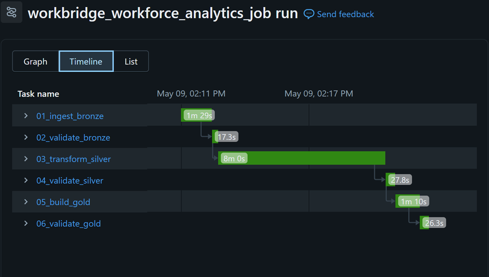

# Databricks Job Orchestration

## Objective

This document describes how the WorkBridge Workforce Analytics pipeline is orchestrated using a Databricks Job.

The Job automates the execution of the complete Bronze, Silver and Gold pipeline, from raw data ingestion to final Gold layer validation.

## Job Name

`workbridge_workforce_analytics_job`

## Execution Mode

The Job can be executed manually using **Run now** and is also configured with a monthly schedule to support the monthly executive reporting use case.

## Task Order

The Job runs the notebooks sequentially:

1. `01_ingest_bronze`
2. `02_validate_bronze`
3. `03_transform_silver`
4. `04_validate_silver`
5. `05_build_gold`
6. `06_validate_gold`

Each task depends on the successful completion of the previous task.

## Pipeline Flow

Raw files  
↓  
`01_ingest_bronze`  
↓  
`02_validate_bronze`  
↓  
`03_transform_silver`  
↓  
`04_validate_silver`  
↓  
`05_build_gold`  
↓  
`06_validate_gold`  
↓  
Validated Gold analytical model

## Layers Produced

### Bronze

Raw source data is ingested and persisted as Delta tables with ingestion metadata.

### Silver

Data is cleaned, standardized and validated.

Critical invalid records and warning-level issues are stored in `silver_rejected_records`.

### Gold

The analytical model is created with dimensions and fact tables ready for reporting.

Gold tables include:

- `dim_region`
- `dim_date`
- `dim_employee`
- `dim_client`
- `fact_workforce_monthly`
- `fact_goals_monthly`

## Validation Outputs

The pipeline creates persistent quality logs:

- `bronze_quality_log`
- `silver_quality_log`
- `gold_quality_log`

These logs provide evidence that each layer was validated after processing.

## Successful Job Execution

The full Job was executed successfully in Databricks.

## Notes

The Job provides operational orchestration for the project. Instead of manually running each notebook, Databricks executes the full pipeline in the correct order.

If any task fails, downstream tasks are not executed, preventing invalid data from being propagated into later layers.